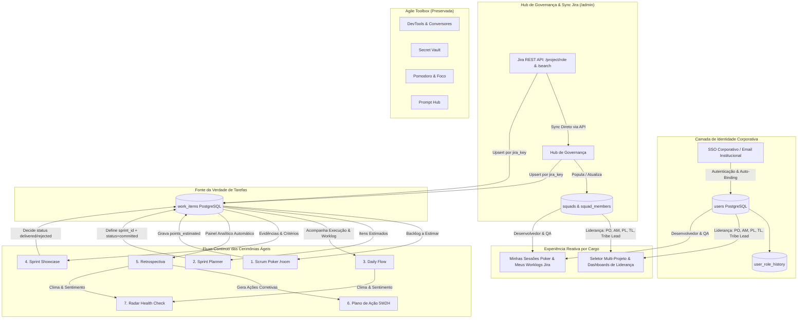

# Plano Mestre de Integração Contínua de Cerimônias e Governança Ágil

**Status:** Design & Execução  
**Arquitetura:** Spring Boot 3.2.4 (Java 17) + PostgreSQL 16 + Next.js 15 (React 19 / TypeScript / Tailwind)  
**Objetivo:** Unificar as cerimônias ágeis (Poker ➔ Planner ➔ Daily Flow ➔ Showcase ➔ Retro ➔ Action Plan ➔ Health Check) através de uma entidade central (`work_items`), com **identidade corporativa única** (preparada para SSO), **sincronização direta via API do Jira** (eliminando dependência de XML) e **governança reativa por projeto e cargo**.

---

## 1. Visão Arquitetural Geral



---

## 2. Modelo de Identidade Única & Preparação para SSO Corporativo

### 2.1 Princípio da Identidade Universal
- **Eliminação de Múltiplos Cadastros**: Nenhuma cerimônia ou sessão terá cadastro de participante independente (acabam `PokerParticipant`, `RetroParticipant` e `SessionMember` desconexos).
- **Chave Mestra**: A identidade do usuário no sistema é o **email corporativo institucional** (ex: `nome.sobrenome@empresa.com.br`), que é universal entre Jira, TDN, Espaço Ágil e o futuro SSO Corporativo.
- **Fim dos Perfis Guest**: O acesso corporativo autenticado é a regra; dados nominais e fotos são extraídos do perfil oficial.

### 2.2 Algoritmo de Auto-Binding no 1º Login
Quando a liderança sincroniza um projeto no `/admin`, a tabela `squad_members` é pré-populada com os nomes, emails e `jira_account_id` dos profissionais do projeto.
Quando o usuário loga pela primeira vez:
1. O backend busca em `squad_members` registros com o mesmo `email` ou `jira_account_id`;
2. Atualiza o campo `claimed_by_uid = users.id`;
3. O usuário já entra com seu projeto, cargo e permissões instantaneamente amarrados.

### 2.3 Modelo de Dados DDL: Usuários e Histórico de Cargos
```sql
CREATE TABLE users (
  id VARCHAR(255) PRIMARY KEY, -- Identificador Único Universal (UUID ou Email)
  email VARCHAR(255) UNIQUE NOT NULL, -- Chave Mestra Corporativa
  name VARCHAR(255) NOT NULL,
  role VARCHAR(50) NOT NULL, -- Developer, QA, Product Owner, Agile Master, People Lead, Tech Lead, SME, Tribe Lead, Agile Coach, Admin
  jira_account_id VARCHAR(255),
  sso_id VARCHAR(255) UNIQUE, -- Reservado para o SSO Corporativo
  avatar_seed VARCHAR(100),
  daily_hours INT DEFAULT 8,
  is_guest BOOLEAN DEFAULT FALSE,
  created_at TIMESTAMP DEFAULT NOW(),
  updated_at TIMESTAMP DEFAULT NOW()
);

CREATE TABLE user_role_history (
  id UUID PRIMARY KEY DEFAULT gen_random_uuid(),
  user_id VARCHAR(255) NOT NULL REFERENCES users(id) ON DELETE CASCADE,
  previous_role VARCHAR(50),
  new_role VARCHAR(50) NOT NULL,
  changed_by VARCHAR(255),
  changed_at TIMESTAMP DEFAULT NOW()
);
```

---

## 3. Mapeamento de Cargos, Hierarquia Jira e Permissões

### 3.1 Cargos Mapeados a partir do Jira (ex: Projeto `DDWMISSI`)

| Cargo no Sistema | Origem no Jira (Project Roles / CustomFields) | Papel no Fluxo Contínuo | Acesso a Telas |
| :--- | :--- | :--- | :--- |
| **Product Owner (PO)** | `Product Owner` / `PO` | Priorização de backlog, critérios de aceite, veredito final no Showcase. | Rituais + Dashboard PO no `/squad/dashboards/product-owner` |
| **Agile Master (AM) / Scrum Master (SM)** | `Agile Master` / `Scrum Master` / `AM` | Facilitação dos rituais, acompanhamento de impedimentos na Daily, condução da Retro. | Rituais + Dashboard AM no `/squad/dashboards/agile-master` |
| **People Lead (PL)** | `People Lead` / `PL` | Gestão de pessoas, capacidade nominal individual, acompanhamento de bem-estar. | Rituais + Dashboard PL no `/squad/dashboards/people-lead` |
| **Tech Lead (TL) / Arquiteto** | `Tech Lead` / `Arquiteto` | Refinamento técnico de histórias, qualidade de código, mitigação de débito técnico. | Rituais + Dashboard TL no `/squad/dashboards/tech-lead` |
| **Subject Matter Expert (SME)** | `SME` / `Subject Matter Expert` | Especialista de regras de negócio, apoio ao PO no refinamento e Showcase. | Rituais + Validação no Showcase |
| **Developer (DEV)** | `customfield_10046` / `Developers` / Assignee | Estimativas técnicas no Poker, codificação, registro de worklog no Jira, Daily. | Rituais + Dashboard DEV no `/squad/dashboards/member` |
| **Quality Assurance (QA)** | `customfield_25307` / `QA Analyst` | Estimativas de teste no Poker, validação de critérios de aceite, apontamento de bugs. | Rituais + Dashboard QA no `/squad/dashboards/member` |
| **UX / Designer** | `UX/UI Designer` | Refinamento de usabilidade, validação de telas no Showcase. | Rituais + Dashboard UX no `/squad/dashboards/member` |
| **Tribe Lead / Agile Coach** | `Tribe Lead` / `Agile Coach` | Governança multi-squad, maturidade ágil, comparativos da tribo. | Visão Consolidada de Tribo no `/squad/dashboards/tribe-level` |

---

## 4. Sincronização Direta Jira API (Hub de Governança `/admin`)

### 4.1 Endpoints Jira Consumidos pelo Backend
O backend conecta-se ao Jira via REST API corporativa com as seguintes chamadas:
1. `GET /rest/api/2/project/{projectKey}`: Metadados do projeto (Nome, ID, Chave, Avatar).
2. `GET /rest/api/2/project/{projectKey}/role`: Lista todos os papéis configurados e seus membros/atores atribuídos.
3. `GET /rest/api/2/search`: JQL para extrair as histórias da sprint ativa, campos customizados (`customfield_10046`, `customfield_25307`, PO, SME), critérios de aceite e worklogs.

### 4.2 Modelo de Dados DDL: `squads` e `squad_members`
```sql
CREATE TABLE squads (
  id VARCHAR(100) PRIMARY KEY, -- ex: DDWMISSI, VAREJO
  name VARCHAR(255) NOT NULL,
  jira_project_key VARCHAR(50) NOT NULL,
  jira_domain VARCHAR(255),
  sync_jql TEXT,
  sprint_field_id VARCHAR(50),
  active_sprint_id VARCHAR(50),
  default_daily_capacity_hours DOUBLE PRECISION DEFAULT 8.0,
  ranking_enabled BOOLEAN DEFAULT TRUE,
  last_sync_at TIMESTAMP,
  last_sync_status VARCHAR(50),
  updated_at TIMESTAMP DEFAULT NOW()
);

CREATE TABLE squad_members (
  db_id VARCHAR(255) PRIMARY KEY, -- {squadId}_{jiraAccountId}
  squad_id VARCHAR(100) NOT NULL REFERENCES squads(id) ON DELETE CASCADE,
  jira_account_id VARCHAR(255) NOT NULL,
  display_name VARCHAR(255) NOT NULL,
  email VARCHAR(255),
  role VARCHAR(50), -- Cargo atribuído no projeto
  capacity_hours_per_day DOUBLE PRECISION DEFAULT 8.0,
  claimed_by_uid VARCHAR(255) REFERENCES users(id),
  updated_at TIMESTAMP DEFAULT NOW(),
  CONSTRAINT uk_squad_member UNIQUE (squad_id, jira_account_id)
);
```

---

## 5. Entidade Central `work_items` & Ciclo de Vida Contínuo

### 5.1 Estrutura da Tabela `work_items`
```sql
CREATE TABLE work_items (
  id VARCHAR(255) PRIMARY KEY, -- UUID ou {squadId}_{jiraKey}
  squad_id VARCHAR(100) NOT NULL REFERENCES squads(id),
  sprint_id VARCHAR(50),
  jira_key VARCHAR(50) NOT NULL,
  title VARCHAR(255) NOT NULL,
  description TEXT,
  acceptance_criteria TEXT,
  type VARCHAR(50), -- História, Bug, Tarefa, Débito Técnico
  priority VARCHAR(50),
  assignee_name VARCHAR(255),
  assignee_id VARCHAR(255),
  dev_name VARCHAR(255),
  qa_name VARCHAR(255),
  points_estimated DOUBLE PRECISION, -- Gravado pelo Scrum Poker
  points_final DOUBLE PRECISION,
  estimate_sec BIGINT,
  remaining_sec BIGINT,
  logged_sec BIGINT,
  status VARCHAR(50) NOT NULL, -- backlog, committed, delivered, rejected, carried_over
  evidence_problem TEXT,
  evidence_solution TEXT,
  evidence_video_url TEXT,
  decision VARCHAR(50), -- open, approved, needs_adjustment, rejected
  decision_feedback TEXT,
  decided_by VARCHAR(255),
  decided_at TIMESTAMP,
  created_at TIMESTAMP DEFAULT NOW(),
  updated_at TIMESTAMP DEFAULT NOW(),
  CONSTRAINT uk_work_item_squad_key UNIQUE (squad_id, jira_key)
);
```

### 5.2 O Ciclo Fechado das Cerimônias
1. **Sync Jira / Backlog**: Puxa as issues para `work_items` com `status = 'backlog'`.
2. **Scrum Poker (Refinamento)**: Rodada finalizada ➔ atualiza `points_estimated` e notas técnicas em `work_items`.
3. **Sprint Planner (Planejamento)**: Seleciona itens pontuados do backlog ➔ vincula `sprint_id` e atualiza `status = 'committed'`.
4. **Daily Flow (Execução Diária)**: Sincroniza worklogs e tarefas em andamento do Jira vinculadas ao desenvolvedor.
5. **Sprint Showcase (Review)**: PO/SME visualiza evidências ➔ define veredito (`delivered`, `rejected`, `carried_over`) e registra feedback em `work_items`.
6. **Retrospectiva**: Carrega automaticamente o painel analítico da Sprint (Comprometido vs Entregue, Velocity real, Carry-overs destacados).
7. **Plano de Ação (5W2H)**: Ações geradas na Retro são rastreadas entre sprints e cobradas na Retro seguinte.
8. **Radar Health Check**: Diagnóstico do clima da squad para People Lead e time.

---

## 6. Dashboards Especializados para Lideranças (`/squad/dashboards`)

### 6.1 Hub de Painéis Personalizados por JQL (`/squad/dashboards/custom`)
- **Queries JQL Ad-Hoc**: Permite a gestores e membros criarem cards de gráficos customizados (Número, Barras, Pizza, Tabela de Tarefas) preenchendo consultas JQL diretas do Jira.
- **Redirecionamento Unificado**: A rota legada `/squad/panels` redireciona automaticamente para `/squad/dashboards/custom`.

### 6.2 Dashboard do Product Owner (PO) (`/squad/dashboards/product-owner`)
- **Say/Do Ratio**: % de Story Points comprometidos no Planner vs. entregues no Showcase.
- **Backlog Readiness**: Quantidade de histórias com critérios prontos para entrar no Poker.
- **Taxa de Aprovação no Showcase**: Histórico de aprovação de 1ª rodada vs. retrabalho.
- **Rastreador de Carry-Over**: Histórias que rolaram de sprints anteriores com dias acumulados.

### 6.2 Dashboard do Agile Master (AM) / Scrum Master (SM) (`/squad/dashboards/agile-master`)
- **Métricas de Rituais**: Tempo médio por história no Poker, índice de divergência/consenso.
- **Resolução de Bloqueios**: Quantidade de impedimentos reportados na Daily e MTTR (tempo médio de resolução).
- **Aderência aos Planos de Ação**: % de ações de retrospectivas anteriores concluídas.
- **Fator de Foco**: Capacidade teórica da engenharia vs. horas líquidas em histórias vs. tempo em reuniões/bloqueios.

### 6.3 Dashboard do People Lead (PL) (`/squad/dashboards/people-lead`)
- **Equilíbrio de Carga Nominal**: Horas lançadas no Jira vs. Capacidade individual por membro (com alerta de sobrecarga >100% ou ociosidade <50%).
- **Gestão de Capacidade & Férias**: Ajuste de horas diárias por membro e registro de ausências programadas.
- **Radar de Sentimento (Health Check)**: Evolução do clima e segurança psicológica da squad.

### 6.4 Dashboard do Tech Lead (TL) (`/squad/dashboards/tech-lead`)
- **Distribuição de Esforço**: % Features vs. % Bugs vs. % Débito Técnico.
- **Bug Escape Rate**: Bugs reportados em homologação por história entregue.
- **Gargalos de Esteira**: Tempo médio de permanência em Code Review e Testes QA.

### 6.5 Dashboard de Tribo (Tribe Lead & Agile Coach) (`/squad/dashboards/tribe-level`)
- **Matriz Comparativa Multi-Squad**: Tabela consolidando velocity, previsibilidade, saúde do clima e cumprimento de rituais de todas as squads da tribo.

---

## 7. Roadmap Detalhado de Execução em Fases

### 🚀 Fase 0: Backend — Identidade Unificada, Jira Sync & WorkItems
**Meta:** Preparar a base de dados relacional e serviços de backend que sustentam o novo ecossistema.
- [x] **0.1**: Atualizar a entidade `User` e criar `UserRoleHistory` (identidade corporativa por email).
- [x] **0.2**: Atualizar `Squad` e `SquadMember` adicionando o campo `role` e auto-binding (`claimed_by_uid`).
- [x] **0.3**: Criar entidade `WorkItem` no Postgres com métodos de upsert em lote por `(squad_id, jira_key)`.
- [x] **0.4**: Implementar `JiraAdminService` e endpoint `POST /api/admin/jira/sync-project` que consulta metadados, papéis e membros via Jira REST API.
- [x] **0.5**: Criar endpoint `GET /api/users/{uid}/squads` para suportar o seletor multi-projeto.
- [x] **0.6**: Criar testes de integração validando o sync da API do Jira e o auto-binding no login.

---

### 🎨 Fase 1: Frontend — Refatoração de `/admin` & Governança de Projetos
**Meta:** Entregar o novo Hub Administrativo para que a liderança gerencie projetos e membros.
- [x] **1.1**: Refatorar a rota `src/app/admin/page.tsx` substituindo painéis obsoletos pelo novo **Hub de Governança**.
- [x] **1.2**: Criar modal de **Sincronização Jira API** (busca por chave de projeto, ex: `DDWMISSI`).
- [x] **1.3**: Desenvolver a tabela de **Gestão de Pessoas & Cargos** com status de auto-vínculo e ajuste de capacidade.
- [x] **1.4**: Implementar o **Seletor Global de Projeto/Squad** no Header para lideranças.
- [x] **1.5**: Implementar a lógica de auto-binding transparente no `UserContext`.

---

### 🃏 Fase 2: Reatividade nas Cerimônias (Scrum Poker & Daily Flow)
**Meta:** Tornar a experiência do desenvolvedor e da squad reativa e conectada ao Jira.
- [x] **2.1**: Refatorar o Scrum Poker (`/room/[id]`) para usar estritamente a identidade `users.id` (sem modal de guest) e salvar estimativas em `work_items`.
- [x] **2.2**: Adicionar visualização reativa no Poker: "Minhas Sessões Participadas" e "Sessões da Minha Squad".
- [x] **2.3**: Conectar o Daily Flow (`/daily-flow`) para exibir automaticamente o worklog do Jira do desenvolvedor e o mural da squad.

---

### 🔄 Fase 3: Ciclo Completo (Planner ➔ Showcase ➔ Retro ➔ Dashboards)
**Meta:** Fechar o ciclo contínuo entre planejamento, validação, retrospectiva e métricas.
- [x] **3.1**: Sprint Planner carrega `work_items` estimados do Poker e aloca na sprint (`status = committed`).
- [x] **3.2**: Sprint Showcase carrega itens comprometidos e permite ao PO/SME registrar veredito e feedback em `work_items`.
- [x] **3.3**: Retrospectiva abre com resumo automático da sprint (Velocity real, Previsto vs Entregue, Carry-overs).
- [x] **3.4**: Implementar os dashboards analíticos de liderança para PO, AM, PL, Tech Lead e Tribo no `/squad/dashboards`.

---

### 🛡️ Fase 4: Validação E2E, Auditoria de Performance & Transição SSO
**Meta:** Garantir robustez, alta performance e prontidão para o SSO corporativo.
- [x] **4.1**: Testes ponta a ponta do ciclo ágil completo.
- [x] **4.2**: Validação de segurança e auditoria (`AuditLog`).
- [x] **4.3**: Documentação de chaveamento para o SSO corporativo definitivo.
